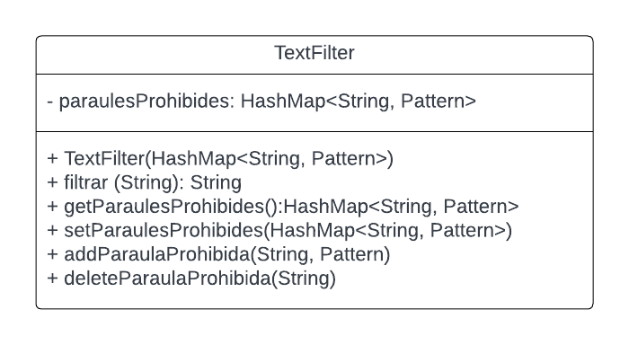
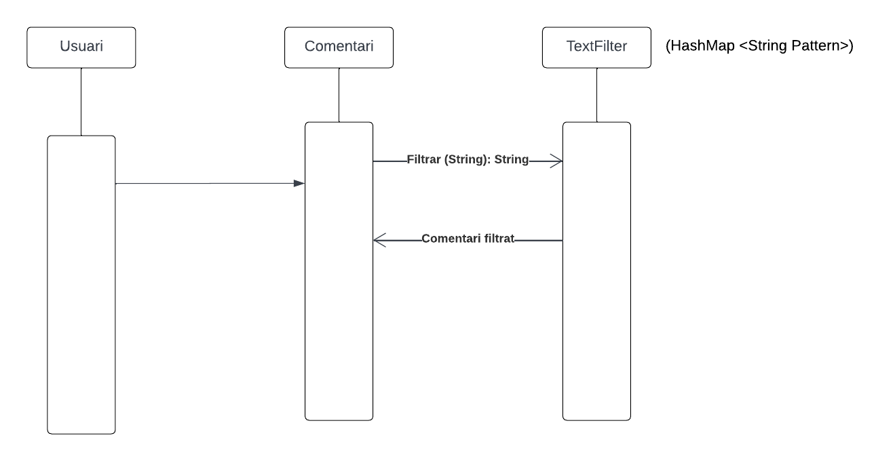
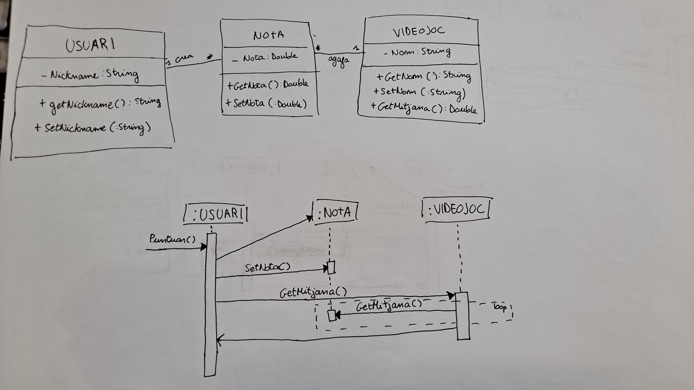

Aplicació Videojocs
===================

Objectiu
--------

Aprenentatge de procediments relacionats amb el desenvolupament de programari:
- Ús dels IDEs, refactorització i generació automàtica de codi. 
- Proves automatitzades.
- Git.
- UML.

Tecnologies
-----------

- Java

Diagrames
---------

 

